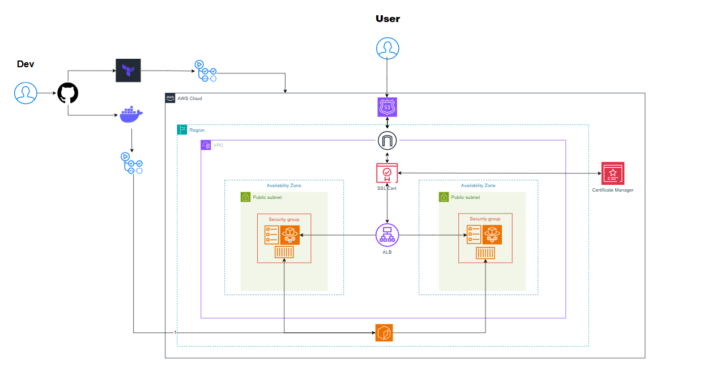

# App: deltavids 

Deltavids is a global online video sharing platform where users watch videos online for free. Features a wide range of videos, including educational content, entertainment, sports, and more. 

## Table of Contents 📚
- [App: deltavids](#app-deltavids)
  - [Table of Contents 📚](#table-of-contents-)
  - [🎥Live Demonstration](#live-demonstration)
  - [App Dependencies](#app-dependencies)
    - [Local Setup](#local-setup)
      - [App Setup](#app-setup)
      - [Vault-Packer AMI Setup](#vault-packer-ami-setup)
  - [Secure Multi-stage Docker Build](#secure-multi-stage-docker-build)
  - [Terraform Structure](#terraform-structure)
    - [Modules](#modules)
    - [Environments](#environments)
    - [Backend](#backend)
    - [Usage](#usage)
  - [Vault-Packer Structure](#vault-packer-structure)
    - [Packer Configuration](#packer-configuration)
  - [Deployment Workflow](#deployment-workflow)
      - [ECR Image Management](#ecr-image-management)
      - [Terraform Infrastructure Management](#terraform-infrastructure-management)
      - [Packer Pipeline](#packer-pipeline)
  - [AWS Services Used](#aws-services-used)
  - [Architecture Diagram](#architecture-diagram)
  - [Contributions](#contributions)
  - [Licensing](#licensing)
---


## 🎥Live Demonstration

<div style="text-align: center; margin: 20px 0;">
  <h3>Prod:</h3>
  <div style="width: 400px; margin: 0 auto; border-radius: 10px;overflow: hidden; box-shadow: 0 4px 8px rgba(0, 0, 0, 0.1);">
    
  </div>
</div>

<div style="text-align: center; margin: 20px 0;">
  <h3>Stage:</h3>
  <div style="width: 400px; margin: 0 auto; border-radius: 10px; overflow: hidden; box-shadow: 0 4px 8px rgba(0, 0, 0, 0.1);">
    
  </div>
</div>

--- 

## App Dependencies

| Dependency  | Description                                                                     | Instructions                                                                  |
|-------------|---------------------------------------------------------------------------------|-------------------------------------------------------------------------------------------|
| npm         | Node Package Manager for JavaScript dependencies.                                | [https://nodejs.org/](https://nodejs.org/)                                               |
| Terraform   | Infrastructure as code tool for provisioning and managing cloud resources.           | [https://www.terraform.io/downloads.html](https://www.terraform.io/downloads.html)           |
| Packer      | Tool for building machine images for cloud environments.                    | [https://www.packer.io/downloads](https://www.packer.io/downloads)                       |
| Docker      | Tool to containerise application           | [https://docs.docker.com/get-docker/](https://docs.docker.com/get-docker/)                |


### Local Setup

#### App Setup
To set up the app locally, follow these steps:
1.  **Install dependencies:**
    ```bash
    npm install
    ```


2.  **Run server locally:**
    ```bash
    npm run dev
    ```


#### Vault-Packer AMI Setup

Make sure you're in packer-vault folder before running these commands.

1.  **Initialise Packer:**
    ```bash
    packer init .
    ```

2.  **Check for format:**
    ```bash
    packer fmt .
    ```

3.  **Validate Packer:**
    ```bash
    packer validate .
    ```

4.  **Build the Vault AMI:**
    ```bash
    packer build vault-ami.pkr.hcl
    ```


## Secure Multi-stage Docker Build

-   **Build Stage (node:23-slim):** Builds the app using Node.js slim image, installing dependencies and compiling.
-   **Prod Stage (node:23-alpine):** Deploys the built app using a minimal Alpine Node.js image, installs `serve`, creates a non-root user, and serves the `dist` directory.

**Key Security Practices:**

-   Multistage build minimises image size.
-   Uses a non-root user in the final image.
-   Alpine base for reduced attack surface.


## Terraform Structure

```
terraform/
├── environments/
│   ├── prod.tfvars
│   └── stage.tfvars
├── modules/
│   ├── acm/
│   │   ├── main.tf
│   │   ├── outputs.tf
│   │   └── variables.tf
│   ├── alb/
│   │   ├── main.tf
│   │   ├── outputs.tf
│   │   └── variables.tf
│   ├── ecs/
│   │   ├── main.tf
│   │   ├── outputs.tf
│   │   └── variables.tf
│   ├── route53/
│   │   ├── main.tf
│   │   ├── outputs.tf
│   │   └── variables.tf
│   └── vpc/
│       ├── main.tf
│       ├── outputs.tf
│       └── variables.tf
├── backend.tf
├── main.tf
├── provider.tf
└── variables.tf
```

### Modules

-   **VPC**: Sets up the virtual private network, including subnets, route tables, internet gateways, and security groups.
-   **ALB**: Manages Application Load Balancers for distributing incoming traffic.
-   **ECS**: Deploys and manages Elastic Container Service clusters and tasks.
-   **Route53**: Configures DNS records using Route 53.
-   **ACM**: Provisions and manages AWS Certificate Manager certificates for SSL/TLS.

### Environments

-   **prod.tfvars**: Defines variables specific to the production environment.
-   **stage.tfvars**: Defines variables specific to the staging environment.

### Backend

-   `backend.tf`: Configures the Terraform backend for storing state remotely (in S3). This is essential for team collaboration and state management. Also for state locking use DynamoDB.

### Usage

1.  **Configure AWS Credentials**: Ensure your AWS credentials are properly configured.
2.  **Create Workspaces**: Run `terraform workspace new stage` & `terraform workspace new prod`
3.  **Initialise Terraform**: Run `terraform init` to initialise the modules and backend.
4.  **Select Environment**: Run `terraform workspace select stage` or `terraform workspace select stage`
5.  **Plan Changes**: Run `terraform plan -var-file="environments/stage.tfvars"` or `terraform plan -var-file="environments/prod.tfvars"` to preview the changes.
6.  **Apply Changes**: Run `terraform apply -var-file="environments/stage.tfvars"` or `terraform apply -var-file="environments/prod.tfvars"` to apply the changes.


## Vault-Packer Structure

```
packer-vault/
├── files/
│   ├── vault.hcl
│   └── vault.service
├── scripts/
│   └── install_vault.sh
└── vault-ami.pkr.hcl
```

### Packer Configuration

-   **`vault-ami.pkr.hcl`**: Builds a Vault AMI using `amazon-ebs`, running `install_vault.sh`.
-   **`install_vault.sh`**: Installs Vault, creates the `vault` user, and sets up Vault as a systemd service.
-   **`vault.service`**: Systemd unit file to run Vault as a service, defining user, group, and execution.
-   **`vault.hcl`**: Vault configuration with listener, file storage, and UI enabled.


## Deployment Workflow
The deployment process is automated using GitHub Actions to ensure consistency. It comprises ECR image management and Terraform infrastructure management, with secure credential handling via HashiCorp Vault.

#### ECR Image Management

* **Image Build and Scan :** This workflow is triggered with a pull request to the specific environment, builds a Docker image, and scans it for vulnerabilities using Trivy.
* **Image Push to ECR :** This workflow is triggered by app changes to the `app` directory, combined with commits to the stage or prod environment branches.


#### Terraform Infrastructure Management

* **Terraform Plan :** These workflows are triggered with a pull request to the specific environment. They also perform linting and security scans using Checkov.
* **Terraform Apply :** These workflows apply the Terraform changes. It's triggered by terraform changes to the `terraform` directory, combined with commits to the stage or prod environment branches.
* **Terraform Destroy :** These workflows destroy the Terraform Infra and require manual confirmation.

#### Packer Pipeline

* **Push Vault AMI :**  The workflow runs only when files in the `packer-vault/` directory in the main branch. The way it works is that it retrieves AWS credentials from Vault and uses Packer to create the AMI.  

All Terraform workflows:

     Retrieve AWS credentials from Vault.
  

## AWS Services Used

| Service                  | Description                                                                     |
| ------------------------ | ------------------------------------------------------------------------------- |
| VPC                      | Virtual Private Cloud for network isolation and security.                     |
| ALB                      | Application Load Balancer for routing traffic to ECS Fargate service and reverse proxying. |
| ECS                      | Elastic Container Service for running containers, creating task definitions, and services. |
| ECR                      | Elastic Container Registry for storing and managing Docker images.                |
| Security Groups (SG)     | Firewall rules for controlling inbound and outbound traffic.                  |
| Route53                  | DNS management for the custom domain                   |
| ACM                      | AWS Certificate Manager for SSL/TLS certificates.                               |
| IAM                      | Identity and Access Management for secure access control of resources used.        |
| Internet Gateway (IG)    | To enable internet access to the VPC.  


## Architecture Diagram




## Contributions

| Contributor      | Role                     |
|------------------|--------------------------|
| Yacquub Adan     | Product Owner/Team Leader |
| Hersey Nageye    | Scrum Master             |
| Sofian Mahmood   | Developer                |
| Hanad            | Developer                |


## Licensing

This project is licensed by its contributors. Please see the LICENSE file for details. **Direct forking of this project is not permitted.**
